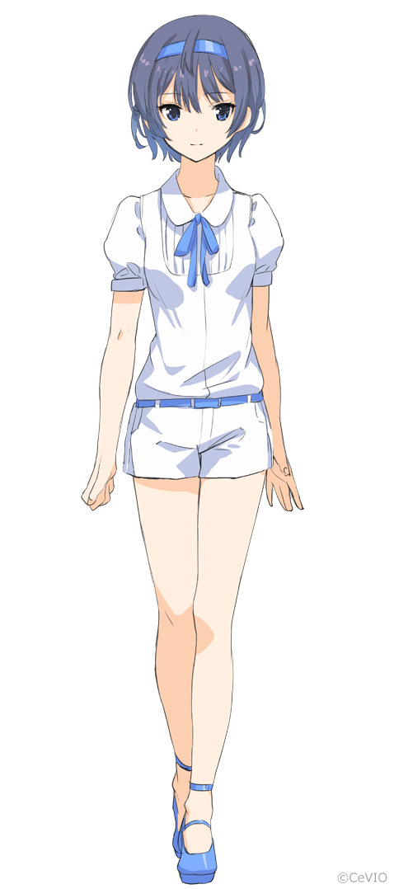

原文：[CeVIO AI ユーザーズガイド ┃ ユーザー画像の表示](https://cevio.jp/guide/cevio_ai/option/characterimage/)

---

将图像（JPEG/PNG/GIF）拖放到屏幕右上方的角色中，就能显示这张图像。

如果遵循了上述的操作，或者将图像拖放到了选项里的「选择右侧显示的画像」，则该图像将注册为用户图像，然后便可以在「图像显示」和「角色画像」里选择它。


- 用户图像会复制到角色图右键菜单「打开画像文件夹」所给出的文件夹中。
- 要删除「显示画像」列表里的用户图像，删掉画像文件夹里的图像即可。
- 通过 `图像文件名.扩展名.ini` 文件，可以精细地控制图像。ini 文件的格式见下。
- 修改用户图像或设定文件后，请重启软件。

```ini title="设定文件的格式"
; ・文件名应遵循『图像文件名.扩展名.ini』的格式。
; ・开头的分号";"为注释，会被自动忽视。
; ・不需要指定设定文件的每一项设置。未设置时将使用默认值。

[Image]
Title=标题
; 列表里显示的标题。
; （默认：文件名）

Center=0.5,0
; 显示的中心点。依水平方向和垂直方向的顺序指定，使用逗号分隔。
; 如果指定的数值在 0.0~1.0 之间，则默认单位是百分比；如果指定的是整数，则默认单位是像素。
; （默认：0.5,0）

Reducible=true
; 指定 true 以允许缩放显示，或 false 以不允许。
; （默认：true）

Preview=50,50,100,100
; 选择画面的预览范围。依[X,Y,宽度,高度]的顺序指定，使用逗号分割。
; （默认：整张图像）

Message=你好
; 鼠标移到画像上时显示的信息。允许多行显示。
; （默认：文件名）
```

## 用户图像与设定文件样例

从下面的链接下载好文件后，将图片拖拽到右上方的画像处，它就会设置为当前角色的角色画像。（也可以从右上方角色图的右键菜单中打开存放用户图像的文件夹，然后将样例图片放到该文件夹中。之后便可以在「选择右侧显示的画像」和「角色画像」里选择它。）

[设定文件样例](https://cevio.jp/storage/cevio_ai/CeVIO_user_image_sample2.png.ini)

※用户图像的样例【すずきつづみ（铃木梓梓弥）】。单击或者右键单击图片以保存。

[](https://cevio.jp/storage/cevio_ai/CeVIO_user_image_sample2.png)
